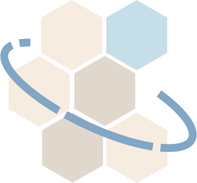
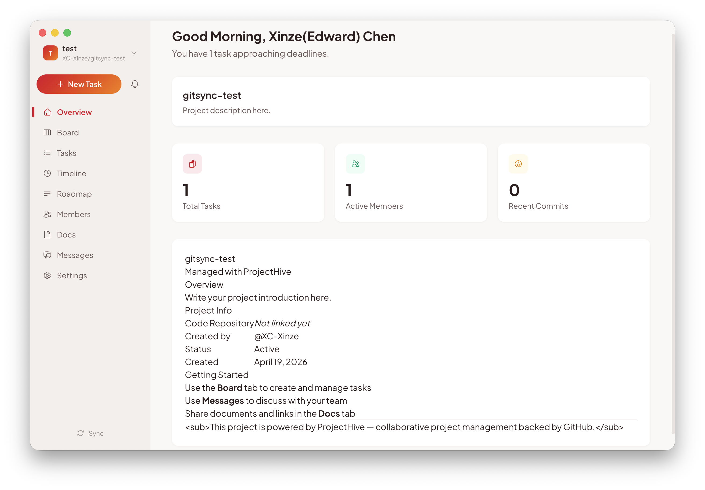
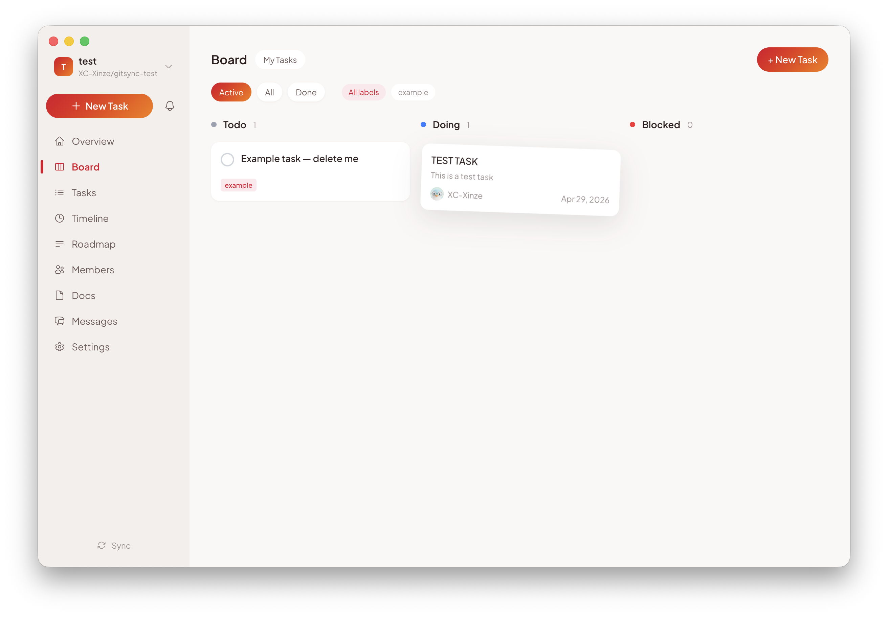
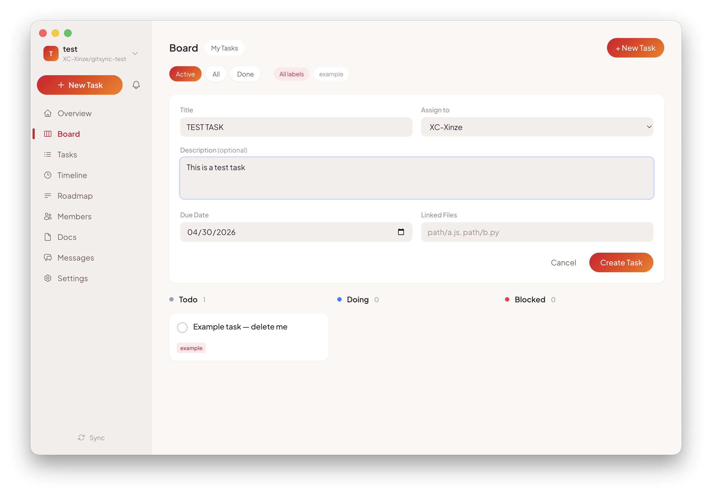
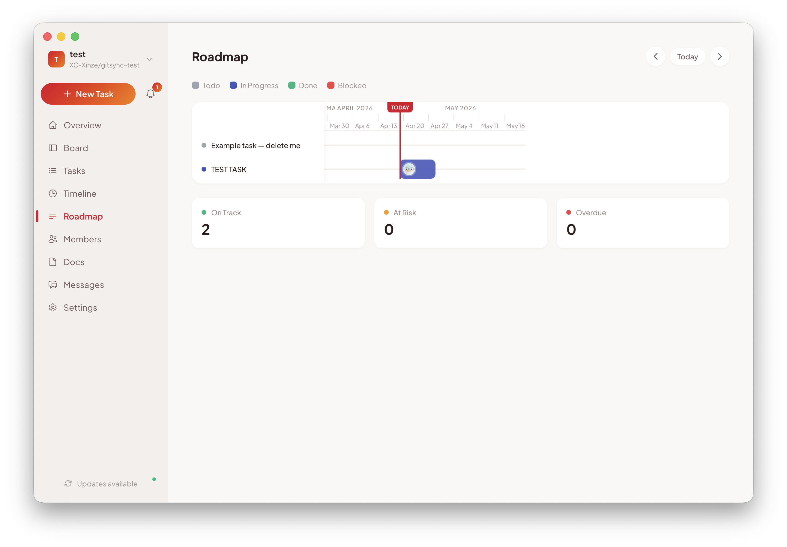
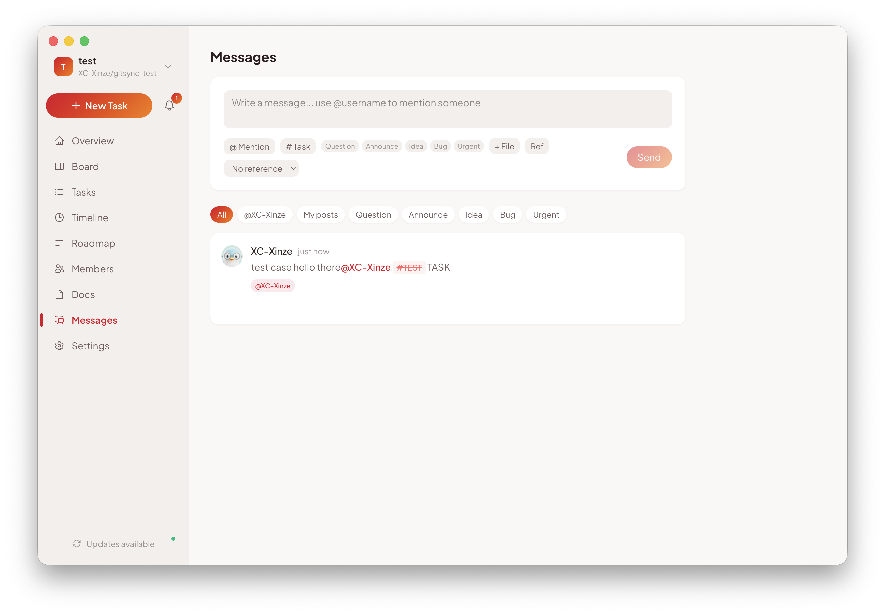
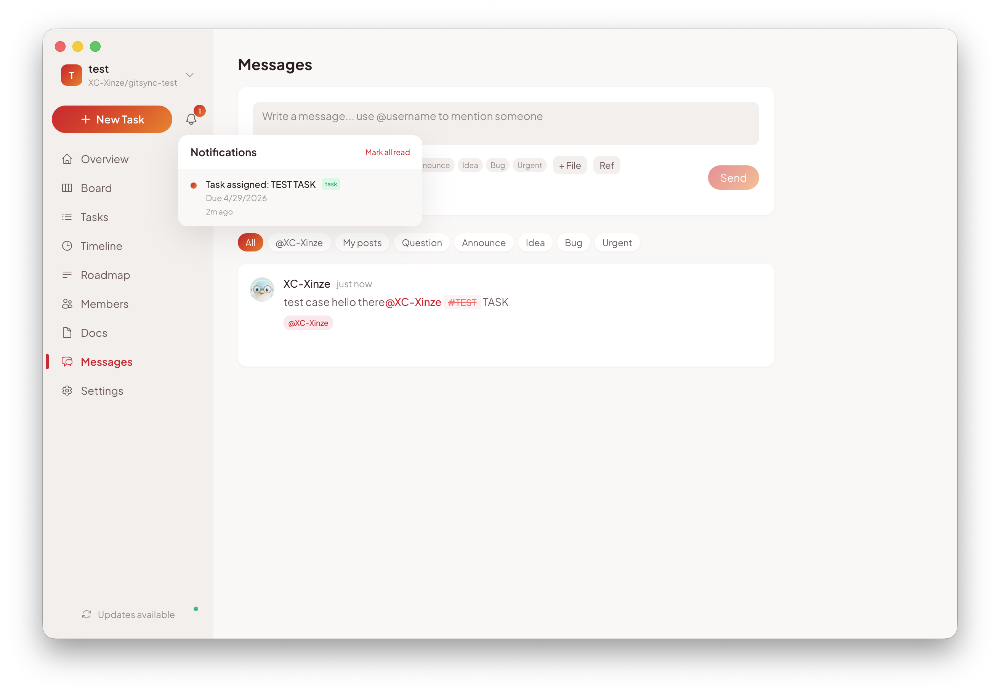
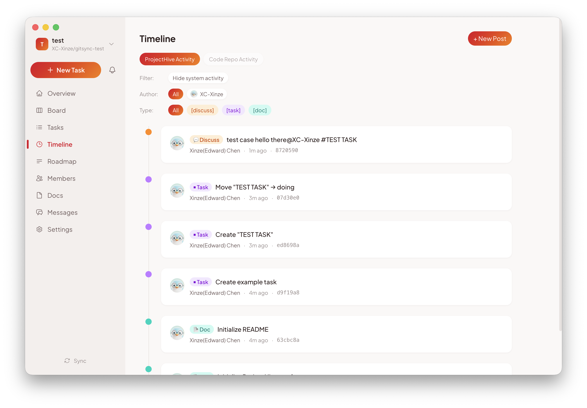

# ProjectHive

<p align="center">
  
</p>

<p align="center">
  <strong>A serverless, GitHub-backed workspace for research and small teams.</strong>
</p>

ProjectHive is a desktop app that turns a private GitHub repository into a complete project workspace — kanban board, roadmap, team chat, document library, and activity timeline — without running any backend of your own. Every task, message, topic, comment, and document is a JSON file committed to your repo, so your project is fully version-controlled, auditable, and portable.

If you can use GitHub, you can use ProjectHive.

---

## Why ProjectHive

Existing project tools force you to pick between **convenience** (Notion, Linear, ClickUp — your data lives on someone else's servers, behind a paywall, with no version history you control) and **control** (running your own Jira / Redmine / Plane instance — a headache no five-person research group wants).

ProjectHive removes that trade-off:

- **No server, no subscription.** Spin it up in under a minute with a GitHub Personal Access Token.
- **Your data lives in your repo.** Every change is a normal git commit you can read, diff, blame, branch, fork, archive, or migrate away from.
- **Permissions = repo permissions.** Add a collaborator on GitHub, they can use the workspace. Remove them, they're out.
- **Designed for research groups and small teams** — features assume 2–20 people who already use git, not 500-person enterprises.
- **Works offline.** Read what you have locally; sync when you reconnect.

---

## Screenshots

### Overview — your project at a glance


### Kanban Board — drag-and-drop task management


### Create tasks with assignees, due dates, labels, and linked files


### Roadmap — Gantt-style timeline with on-track / at-risk / overdue stats


### Messages — team chat with `@mentions`, `#tasks`, `#!topics`, threads, reactions


### Notifications for `@mentions` and task assignments


### Timeline — every commit, filtered by author, type, and project vs code repo


---

## Features

### Tasks & Planning
- **Kanban Board** with four columns (Todo / Doing / Done / Blocked) and drag-and-drop between them
- **Task details** — assignees, due dates with overdue highlighting, labels, descriptions, linked files, optional Topic
- **Roadmap** — Gantt timeline showing all tasks across weeks/months with status indicators and on-track/at-risk/overdue counts
- **Task list view** — filterable, sortable flat table for power users
- **Bidirectional task ↔ message linking** via `#taskName` — referenced tasks open in a modal; deleted tasks render as struck-through

### Communication
- **Messages** — Slack-style team chat with reply threads, emoji reactions, pinned messages, and color-coded labels (Question, Announce, Idea, Bug, Urgent)
- **Topics** — `#!name` tagged threads (Slack/Discord style) with categories (Research, Admin, Temp, Planning), open/archived states, and a collapsible right sidebar to switch between Main discussion and individual topics
- **Mentions** with `@username` notifications and an in-app notification center
- **File attachments** — drag-in or pick-from-repo; files open with your system's default app
- **Inline references** — paste a commit SHA, link to a task, embed a doc

### Project Surface
- **Multi-project switcher** — manage many repos from one window, each picked up by the `gitsync-` prefix convention
- **Documents** — shared link/file library with categories and previews
- **Members** — view and manage GitHub collaborators directly
- **Timeline** — full commit history across both the management repo and the linked code repo, filterable by author and commit type
- **Settings** — five built-in themes (Serene Architect, Modern Blue, Triceratops, XZ Flame, XZ Cool), token management, and per-project config

### Sync & Collaboration
- **Optimistic updates** — your writes appear instantly; we reconcile with the remote in the background
- **Self-commit detection** — your own pushes never trigger the "remote updated" badge
- **Pending-write buffer** — newly created items survive page navigation while GitHub propagates the new commit
- **Conflict dialog** — when two people edit the same task, you choose: overwrite, refresh, or cancel
- **Repo deletion** with type-to-confirm safeguard

---

## Tech Stack

| Layer | Choice |
|---|---|
| Shell | Electron 41 (also runs as a plain web app for dev) |
| UI | React 19 + React Router 7 |
| Build | Vite 8 |
| Styling | Tailwind CSS v4 with custom design tokens |
| State | Zustand 5 with `localStorage` persistence |
| GitHub | `@octokit/rest` (REST + Git Data API) |
| DnD | `@dnd-kit/core` + `@dnd-kit/sortable` |

---

## Getting Started

### Prerequisites

- **Node.js 18+**
- A **GitHub account** and a **Personal Access Token (classic)** with at least the `repo` scope (add `delete_repo` if you want to be able to delete projects from the app)

### Install

```bash
npm install
```

### Run

```bash
# Web only — fastest iteration loop
npm run dev

# Electron + Vite — full desktop experience
npm run dev:electron
```

### Build

```bash
# Web build (outputs to dist/)
npm run build

# Electron distributable (outputs to release/)
npm run build:electron
```

### First-time setup

1. Launch the app and paste your Personal Access Token.
2. The app lists every private repo whose name starts with `gitsync-`. Pick one or click **+ New** to create a fresh project repo from a template.
3. ProjectHive seeds the repo with a `README.md`, a `config.json`, and folders for `tasks/`, `messages/`, `topics/`, `docs/`, and `assets/`.
4. Start adding tasks, messages, topics, and docs — every action becomes a git commit you can inspect at any time.

---

## How It Works

ProjectHive treats a private GitHub repo as a typed file system:

```
gitsync-myproject/
├── README.md              # Auto-generated project landing page
├── config.json            # Project metadata + linked code repo(s)
├── tasks/
│   └── task-1729000000.json
├── messages/
│   └── msg-1729000000.json
├── topics/
│   └── topic-1729000000.json
├── docs/
│   └── doc-1729000000.json
└── assets/
    └── 1729000000-uploaded-file.pdf
```

Every UI action is a small REST call to GitHub:

- **Reading** uses `GET /repos/{owner}/{repo}/contents/{path}` to list folders and fetch JSON.
- **Writing** uses `PUT /repos/{owner}/{repo}/contents/{path}` with the file's SHA, which gives us free optimistic-concurrency control — if two clients edit the same task, the second `PUT` fails and we open the conflict dialog.
- **Notifications** are derived locally by scanning unread messages for `@mentions` and tasks for assignment changes — no webhooks, no polling beyond the standard 30-second background refresh.

Because everything is a commit:

- Every workspace change shows up in the **Timeline** with author, message, and SHA.
- You can `git clone` the repo, grep the JSON, run scripts on it, write your own dashboards, or migrate away.
- Reverting a bad change is `git revert`.
- Forking the project (e.g. for a new semester) is one click on GitHub.

---

## Project Structure

```
src/
├── pages/          # Route pages (Portal, Board, TaskList, Roadmap,
│                     Timeline, Messages, Docs, Members, Settings, …)
├── components/     # Shared UI components (FilePicker, ConflictDialog, …)
├── services/
│   ├── github.js   # All Octokit calls (CRUD for tasks, messages, topics,
│                     docs, assets) plus self-commit notification hook
│   └── template.js # Repo-naming convention, default templates,
│                     topic categories, commit-keyword definitions
├── store/          # Zustand store (auth, theme, notifications,
│                     pending-writes buffer, self-commit SHA tracking)
├── themes.js       # 5 themes, each a full set of CSS custom properties
└── index.css       # Design tokens & Tailwind utilities
electron/
├── main.cjs        # Main process (IPC, file-open via system app)
└── preload.cjs     # Context bridge (token storage, file API)
public/
├── logo.svg        # App logo
└── screenshots/    # Screenshots used in this README
```

---

## License

MIT
