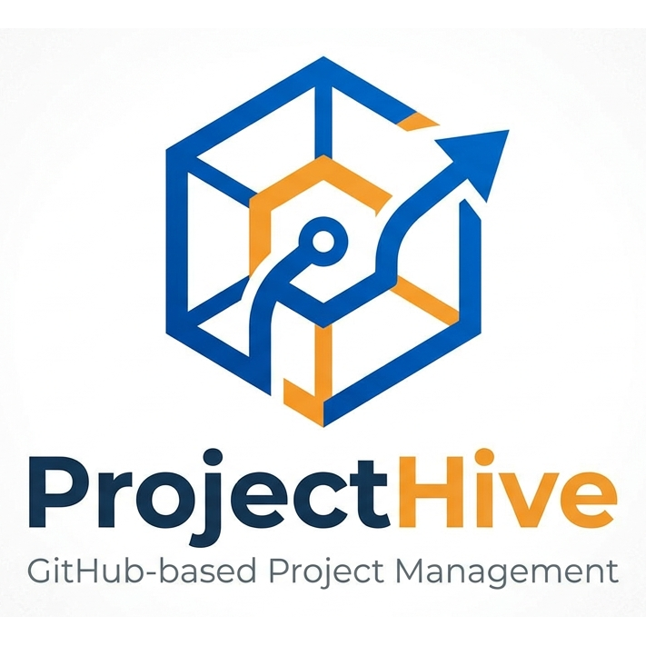

# ProjectHive

<p align="center">
  
</p>

<p align="center">
  <strong>Collaborative research project management, powered by GitHub.</strong>
</p>

A lightweight desktop application for research groups to collaborate on projects using GitHub private repositories as the backend. No extra server required — all data syncs through GitHub's API.

## Features

- **Kanban Board** — Drag-and-drop task management with status columns (Todo, In Progress, Done, Blocked)
- **Task Management** — Full task lifecycle with assignees, due dates, labels, status selection, linked files, and descriptions
- **Task-Message Linking** — Bidirectional references between tasks and messages via `#taskName`; deleted task refs show strikethrough
- **Roadmap** — Gantt-style timeline view of all tasks with status indicators
- **Messages** — Team messaging with @mentions, #task references, emoji reactions, reply threads, pinning, and labels
- **File Attachments** — Upload and share files directly in messages; files open with your system's default app
- **Timeline** — Commit activity feed with keyword badges, system commit filtering, and commit deletion via Git Data API
- **Documents** — Shared document and link library with local file upload and URL support
- **Members** — Collaborator management with invitation support
- **Notifications** — In-app notification center (bell icon with red dot badge) for @mentions and task assignments, with click-to-navigate and clear all
- **Themes** — 5 built-in color themes: Serene Architect, Modern Blue, Triceratops, XZ Flame, XZ Cool
- **Multi-project** — Inline project switcher for managing multiple repositories
- **Sync** — One-click sync button to pull latest changes from the remote repository

## Tech Stack

- **Electron** — Cross-platform desktop app
- **React 19** + **React Router** — UI framework
- **Vite** — Build tool
- **Tailwind CSS v4** — Styling with custom design tokens
- **Zustand** — State management with localStorage persistence
- **@octokit/rest** — GitHub API client (REST + Git Data API)
- **@dnd-kit** — Drag-and-drop

## Getting Started

### Prerequisites

- Node.js 18+
- A GitHub account with a Personal Access Token or OAuth App

### Install

```bash
npm install
```

### Development

```bash
# Web only (for fast iteration)
npm run dev

# Electron + web
npm run dev:electron
```

### Build

```bash
# Web build
npm run build

# Electron distributable
npm run build:electron
```

## Project Structure

```
src/
├── pages/          # Route pages (Portal, Board, TaskList, Timeline, Messages, Docs, Settings, etc.)
├── components/     # Shared components
├── services/       # GitHub API layer (Octokit, file ops, asset uploads)
├── store/          # Zustand store (auth, theme, notifications)
├── themes.js       # Theme definitions (5 themes with full CSS token sets)
└── index.css       # Design tokens & custom utilities
electron/
├── main.cjs        # Electron main process (IPC handlers, file opening)
└── preload.cjs     # Context bridge (GitHub token, file open API)
public/
└── logo.png        # App logo
```

## How It Works

ProjectHive stores all project data (tasks, messages, documents, config) as JSON files in a GitHub private repository prefixed with `gitsync-`. This means:

- No server to host or maintain
- Data is version-controlled with full git history
- Access control is handled by GitHub repository permissions
- Works offline with sync on reconnect

## License

MIT
